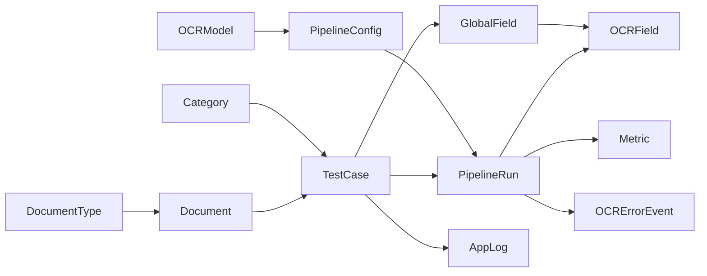

# OCR Testing & Benchmark Platform

## 1. ภาพรวมระบบ

ระบบสำหรับทดสอบ OCR หลาย Pipeline บนภาพหรือ PDF เปรียบเทียบกับข้อความถูกต้องที่ผู้ใช้ยืนยัน และนำ crop พร้อม Ground Truth ไปสร้าง Dataset เหมาะกับผู้ทดสอบ ผู้พัฒนา และทีมที่ต้องเลือกโมเดลจากผลจริงบนเอกสารของตนเอง

ผู้ใช้เตรียมพื้นที่อ่าน ตรวจข้อความ/กรอบ OCR ประเมินความผิดพลาด เปิดประวัติ และดูหลักฐานการเลือก Pipeline ได้ การเปรียบเทียบเป็น **เครื่องมือช่วยตัดสินใจ** จากข้อมูลที่มี ไม่ใช่การรับรองว่าโมเดลหนึ่งจะดีกว่าเสมอ

## 2. เป้าหมายของโปรเจกต์

- ทดสอบหลาย Pipeline ด้วย crop ที่ backend สร้างอย่างสอดคล้องกัน
- ใช้ Ground Truth ที่ยืนยันแล้ว แยกจากคำทำนาย OCR
- วัด CER, WER, Exact Match, confidence และเวลา พร้อมตรวจ substitution/deletion/insertion
- ค้นหาชุดทดสอบที่ยากหรือผลต่างกันมาก และส่งออก Dataset ที่มี label ถูกต้อง
- รองรับ Dynamic Pipeline และอ่านผลย้อนหลังได้แม้เลิกใช้ configuration เดิม

## 3. Workflow

Upload → Global Layout → เลือก Pipeline/รัน OCR → Ground Truth/คำนวณ → History → Comparison → Dataset

1. อัปโหลดภาพ/PDF เลือกประเภทเอกสารทางธุรกิจได้ และเลือกหน้า PDF
2. เตรียม Global Fields ด้วย Auto Layout หรือวาด/ย้าย/ปรับขนาดกรอบเอง แล้วยืนยัน layout
3. เลือก Pipeline ที่เปิดใช้งานและรัน แต่ละ Field ใช้ canonical crop จาก backend; ผลที่สำเร็จยังอยู่เมื่ออีก Pipeline ล้มเหลว
4. กรอกและบันทึก GT จากนั้นคำนวณเพื่อยืนยันผลประเมิน ตรวจ diff และย้อนกลับดูผลที่บันทึกไว้

Field มี UUID และพิกัดอ้างอิงภาพต้นฉบับของหน้านั้น Backend สร้าง PNG แบบ lossless และ SHA-256; browser transform ใช้เพื่อแสดงผล หลังมี OCR แล้ว layout ถูกล็อกตาม workflow ปัจจุบัน หากต้องเปลี่ยน layout ให้สร้างชุดทดสอบใหม่ PDF แต่ละหน้ามี TestCase/layout/results แยกกัน แต่สถิติ Comparison รวมตาม Document

ข้อมูล legacy ยังเปิดผ่าน viewer เดิมได้ รายละเอียดพฤติกรรมของแต่ละรุ่นอยู่ใน [Global Layout](docs/global-layout.md)

## 4. หน้าต่าง ๆ

| หน้า | Route | ใช้ทำอะไร |
|---|---|---|
| OCR Test | `/` และ `/workflow/[id]/…` | อัปโหลด เตรียม Field รัน OCR และประเมิน GT |
| History | `/history` | เปิดผล กรองข้อมูล เลือกหลายรายการและลบประวัติเป็นชุด |
| Comparison | `/matrix` | สรุปคำแนะนำก่อน แล้วเปิดดูคู่/หลักฐานตามต้องการ |
| Dataset | `/dataset` | เลือก source crop + GT ยืนยันเพื่อส่งออก หรือนำออกเป็นชุด |
| Pipeline Settings | `/settings/pipelines` | จัดการโมเดลและ Pipeline |
| System Logs | `/logs` | compatibility route ที่แจ้งว่าปิดการบันทึกลง DB |
| Saved Test | `/test/[id]` | ดูชุดทดสอบและผลย้อนหลัง |

**Analysis รวมเข้า Comparison แล้ว** ใช้แท็บ **สรุปผล** และ **ตามประเภทเอกสาร** ลิงก์เดิม `/analytics/categories` redirect ไป `/matrix?view=by-type` โดยรักษาตัวกรองที่รองรับ

Logs ไม่อยู่ใน navigation สำหรับผู้ใช้ทั่วไป แต่ route/API ยังอยู่ การซ่อนเมนู **ไม่ใช่ access control** ระบบนี้ยังไม่มี login หรือ roles

Comparison แสดงคำแนะนำหรือเหตุผลที่ยังตัดสินผู้ชนะไม่ได้ก่อน ตามด้วยสามการ์ด: ใครนำด้านความแม่นยำ, ข้อมูลเทียบตรงกัน และงานถัดไป แสดงงานสำคัญไม่เกินสามรายการก่อน “ดูทั้งหมด” การเลือกสอง Pipeline โดยตรงใช้ตรวจหลักฐานเท่านั้น ไม่เปลี่ยนคำแนะนำ/ranking ของระบบ สถิติ กราฟ ตารางทุก Pipeline และผลรายชุดทดสอบพับไว้จนผู้ใช้เปิดดู

History เลือกได้สูงสุด 200 รายการรวมหลายหน้า checkbox หัวตารางเลือกเฉพาะแถวที่มองเห็นในหน้าปัจจุบัน เปลี่ยนประเภท/Pipeline/วันที่/ค้นหาชื่อ/สถานะจะล้างการเลือก ต้องยืนยันก่อนลบ ผล OCR, Metrics และ GT ของชุดที่เลือกจะถูกลบ แต่ source Document และชุดทดสอบอื่นของเอกสารเดียวกันยังอยู่

## 5. Comparison Decision Engine

Engine ใช้ผล **latest eligible TestCase × Pipeline** จาก MatrixService เดิม และใช้เฉพาะผลสำเร็จที่มี GT ยืนยัน พร้อม **final run-level Metric** ที่เข้าเกณฑ์ evaluation ไม่รวมผล archived และกรณี Hutch Full เก่าที่เข้าเกณฑ์ input ไม่ถูกต้อง

แต่ละคู่ใช้ intersection: TestCase ต้องมีผลประเมินที่ใช้ได้จาก **ทั้งสอง Pipeline** ไม่เอาค่าเฉลี่ยจากเอกสารคนละชุดมาตัดสินว่าใครชนะ

- หน่วยสถิติ = **Document**; PDF หลายหน้าที่อัปโหลดเป็น Document เดียวไม่เพิ่มจำนวนตัวอย่างอิสระ
- CER ของ Document = ค่าเฉลี่ย CER ของ TestCase ใน cohort ภายใน Document แบบไม่ถ่วงน้ำหนัก
- dCER = CER A − CER B คิดเป็น percentage points (pp); ติดลบแปลว่า A ดีกว่า
- Headline dCER = ค่าเฉลี่ย dCER ของ Documents แบบไม่ถ่วงน้ำหนัก
- `PAIR_TIE_PP=0.05`: เสมอเมื่อ `abs(dCER) < 0.05 pp`; ที่ขอบเขตพอดีนับเป็นชนะ/แพ้
- `MIN_PAIR_DOCS=5`: น้อยกว่า 5 Documents แสดงข้อมูลไม่พอและไม่ประกาศผู้ชนะ
- 95% percentile bootstrap ใช้ 2,000 ครั้ง สุ่ม Documents แบบคืนตัวอย่าง ด้วย seed คงที่ จึงได้ CI เดิมเมื่อข้อมูลเดิม
- CI รวมศูนย์ = ยังสรุปไม่ได้; ไม่รวมศูนย์ = คู่ที่ CER ต่ำกว่าชนะชัดเจนบนหลักฐานชุดนี้

คะแนน active Pipeline คือชนะชัดเจน +1 / แพ้ชัดเจน −1 / อื่น ๆ 0 เรียงคะแนนมากก่อน ตามด้วย mean paired dCER ต่ำก่อนและชื่อ การเรียงเชิงตัวเลขอย่างเดียวไม่ใช่คำแนะนำ

**แนะนำตอนนี้** ปรากฏเมื่ออันดับแรกมีคะแนนนำเพียงตัวเดียว ไม่แพ้ชัดเจนแก่คู่ใด และชนะอันดับสองชัดเจน หากไม่ครบให้แสดง **ยังไม่มี Pipeline ที่ชนะชัดเจน** อย่างตรงไปตรงมา

Toggle **เฉพาะ Pipeline ที่ใช้งานอยู่** เปิดเป็นค่าเริ่มต้น ปิดเพื่อดูข้อมูลเก็บถาวรได้ แต่ recommendation/ranking/คู่หลัก/readiness ของปัจจุบันยังใช้ active เท่านั้น ไม่เปลี่ยนตาม toggle

Readiness ของคู่หลักแสดง X ชุดพร้อมเทียบ / Y ชุดในขอบเขต / D Documents และจำแนกชุดที่ยังไม่พร้อมตามลำดับ: GT ยังไม่ยืนยัน → ยังไม่ได้รัน → รันไม่สำเร็จ → ไม่เข้าเกณฑ์อื่น แต่ละชุดอยู่เหตุผลเดียว ถ้ามี active ไม่ถึงสองตัวจะอธิบายว่ายังไม่มีคู่

สูตรและ schema: [Comparison Decision Engine](docs/comparison-decision-engine.md)

## 6. Accuracy × Speed

แกน X = เวลาเฉลี่ยต่อผลรันที่ประเมินได้ (`processing_time_ms` แปลงเป็นวินาที); แกน Y = Document-mean CER ต่ำทั้งสองแกนดีกว่า จุดทึบต้องมีอย่างน้อย 5 evaluated Documents และ 5 ผลรันสำเร็จที่มีเวลา ข้อมูลเก็บถาวรเป็นจุดโปร่ง/เส้นประ

Global workflow เก็บ processing time เป็น **ผลรวม duration ของ Fields** และรวม gateway durations ที่มีค่า จึงไม่ใช่เวลารอทั้งหน้าหรือ latency ที่ browser วัด

แนว Pareto ใช้ได้เมื่อทุก active Pipeline มี common cohort ร่วมกันอย่างน้อย 5 Documents และมีเวลาให้เทียบ ถ้า common cohort ไม่พอ ใช้ cohort ของแต่ละ Pipeline พร้อมข้อความ **ชุดเอกสารไม่ตรงกัน เทียบกันตรง ๆ ไม่ได้** และไม่วาด frontier ความเร็วไม่ใช้เลือก accuracy recommendation

## 7. ตามประเภทเอกสาร

ใช้ `document_type_id` ซึ่งเป็นประเภทเอกสารทางธุรกิจ ตารางมี **ทุกประเภท**, ประเภทที่มีข้อมูลในขอบเขต และ **ไม่ระบุประเภท** เมื่อมีเอกสารไม่ถูกจัดประเภท ประเภท custom ที่เก็บถาวรแต่ยังถูกอ้างอิงไม่ถูกทิ้ง แต่ละ Document อยู่เพียงประเภทเดียว ผลรวมจำนวน Documents ของประเภทจึงเท่ากับแถวทุกประเภท

หน้าหลักแสดงการ์ดคำแนะนำรายประเภทก่อน รวมทุกประเภท ประเภทที่ใช้งาน ประเภทเก็บถาวรที่ยังมีข้อมูลอ้างอิง และไม่ระบุประเภท ตารางเดิมเปิดจาก **ดูตารางทุก Pipeline** แต่ละช่องเป็น **descriptive Document-mean CER + n Documents** ของ Pipeline นั้น ไม่ใช่ผู้ชนะ หาก n ต่างกันมีคำเตือน ส่วนคำแนะนำรายประเภทใช้ paired engine เดียวกับภาพรวม กดขยายเพื่อดูคู่/CI แถวทุกประเภทใช้ผล engine ของภาพรวมตรงกัน ข้อมูลเก็บถาวรไม่เป็นคำแนะนำปัจจุบัน

## 8. Metrics

| ค่า | ความหมาย |
|---|---|
| CER | Levenshtein character edits / จำนวนอักขระ GT |
| WER | Levenshtein token edits / จำนวน token GT |
| Exact Match | OCR กับ GT เท่ากันหลัง normalization |
| Confidence | ค่าที่ upstream ให้ ถ้าไม่มีใช้ null ไม่สร้างค่าเอง |
| `processing_time_ms` | เวลา adapter/application processing; Global รวมเวลา Fields |
| `gateway_duration_ms` | duration ที่ Gateway รายงาน/ผลรวม stage หรือ Field ที่มีค่า |

Normalization: Unicode NFC, ปรับ CRLF/CR เป็น LF, trim และ collapse whitespace ไม่แก้สะกดหรือเอา punctuation/อักษรไทยออก WER ใช้ whitespace tokenization ภาษาไทยที่ไม่เว้นวรรคจึงอาจเป็น token เดียว CER มักอ่านความผิดพลาดภาษาไทยได้ละเอียดกว่า

Aggregate Sub-field CER/WER = **total edits / total GT units** ไม่ใช่ค่าเฉลี่ยเปอร์เซ็นต์ของแต่ละ Field ส่วน Comparison ใช้ Document-mean เพื่อให้ Document มีน้ำหนักเท่ากัน CER อาจเกิน 100% ได้เมื่อมี insertion มาก ค่า reference ว่างกับ prediction ไม่ว่างมี rate เป็น null; analytics ไม่ใช้ normalized-empty GT

## 9. Ground Truth

GT แยกจาก OCR prediction เสมอ Global Field UUID เป็นตัวเชื่อม GT ร่วมกับผลของทุก Pipeline การบันทึก draft ยังไม่ยืนยัน evaluation การกดคำนวณใน workflow ปัจจุบันบันทึก metrics, alignment และเวลายืนยัน; legacy Field Check เป็น preview ส่วน Confirm จึง persist

- **Whole Document / Whole Field**: ข้อความทั้ง layout เรียงตามลำดับ Global Fields ที่ backend กำหนด ต้องมีผลสำเร็จครบ layout และ GT ยืนยัน
- **Per Field / Sub-fields**: GT ของแต่ละ Global Field; backend รองรับ subset ที่มี GT ยืนยันและผลประเมินแล้ว ภาพรวม legacy semantics นี้ยังคงเดิม UI ปัจจุบันช่วยซิงก์ Whole Field/Sub-fields และกำหนดให้กรอกครบก่อนคำนวณ
- แก้ GT จะ invalidates evaluation ที่เกี่ยวข้อง ต้องคำนวณใหม่ ไม่ใช้ draft เป็นหลักฐานสุดท้าย
- GT ที่ว่างหลัง normalization ไม่เข้าเกณฑ์; GT หนึ่งอักขระที่ไม่ว่างใช้ได้ ไม่มีขั้นต่ำความยาวแบบตั้งเอง

Evaluation ที่เก็บใน DB เป็น compact metrics/edit totals/GT unit counts/mode/field IDs/time ไม่เก็บ duplicate OCR/GT, normalized text copies หรือ events/spans การเปิด detail หรือ Error Analysis จึงคำนวณ alignment จาก OCR + GT เมื่อร้องขอ โดยใช้ normalization และสูตรเดิม ไม่คำนวณระหว่างโหลด History, Dataset หรือ Comparison

Diff แยก substitution (แทนที่), deletion (หายจาก OCR), insertion (เกินใน OCR) พร้อมตำแหน่ง normalized char/token และตัวแสดงความผิดพลาด ดู [Global Layout](docs/global-layout.md) และ [Error Analysis/Dataset](docs/error-analysis-dataset.md)

## 10. Data Model



| Entity | หน้าที่ |
|---|---|
| Document | ไฟล์ต้นฉบับ, storage key, hash, ขนาดและข้อมูล PDF |
| DocumentType | ประเภทเอกสารทางธุรกิจและสถานะใช้งาน |
| TestCase | หน้า/layout/ROI/GT และสถานะการทดสอบ |
| GlobalField | พื้นที่อ่านร่วมและ GT ของ Field ตาม UUID |
| PipelineConfig | configuration ของ Pipeline ที่รันได้ |
| OCRModel | registry รุ่น/weight/source และ paths สำหรับ DET/REC |
| PipelineRun | ผล, compact model provenance, geometry, tracing และเวลา |
| OCRField | คำทำนาย/evaluation ของ PipelineRun ต่อ Field |
| Metric | CER/WER/Exact Match ระดับผลรัน |
| OCRErrorEvent | ตาราง compatibility; evaluation ใหม่ไม่สร้าง rows และคำนวณ alignment เมื่อร้องขอ |
| AppLog | ตาราง compatibility; ปิด DB persistence ใช้ runtime logs สำหรับ failures |
| Category | metadata ภายใน/legacy; ไม่ใช่ตัวกรองผู้ใช้ทั่วไป |

`document_type` เป็นชนิดไฟล์เชิงเทคนิค image/pdf; `document_type_id` เป็น business type ทั้งสองอย่างแยกกัน `document_id` เป็น identifier ภายใน ผู้ใช้ทั่วไปไม่ต้องพิมพ์ UUID เอง ไฟล์ภาพ/PDF อยู่ใน StorageService ไม่เก็บ Base64 ใน PostgreSQL

## 11. Dynamic Pipeline

Settings ใช้ OCR model registry แยก DET และ REC เลือก source Custom/Official, version และ weight ระบบหลังบ้านรองรับ integrated OCR, DET → perspective crops → REC และ REC-only; UI สร้าง Pipeline เป็น DET → REC และเก็บการรองรับ config เก่าไว้

Runtime ใช้ registered batch paths และ repeated multipart `images` query ใน paths เป็น authoritative ไม่เดา weight จากชื่อ Pipeline Official baseline ไม่เพิ่ม `model` ส่วน Custom paths ระบุ model ตาม registry แก้ path มีผลกับการรันครั้งต่อไป ผลเก่าที่มีอยู่ยังอ่านได้ตาม snapshot เดิม ส่วนผลใหม่เก็บเฉพาะ provenance ที่จำเป็น

ไม่มีรายการ fixed Pipelines ที่สร้างกลับอัตโนมัติเพื่อ analytics Pipeline ที่รันได้ขึ้นกับ configuration จริง ไม่ใช่จำนวนคอลัมน์ที่ hardcode การเชื่อมต่อ Gateway สำเร็จไม่ได้รับรองว่าโมเดลทุก combination ออนไลน์ ดู [Dynamic Pipelines](docs/dynamic-pipelines.md) และ [Model Gateway](docs/model-gateway.md)

## 12. Historical Continuity

PipelineRun เก็บ ID/name, compact model identity, OCR text, geometry, metrics และ timing/tracing ของตอนรัน ไม่ archive Gateway response เต็มสำหรับผลใหม่ แม้ PipelineConfig ถูกลบ ผลเดิมยังเปิดและใช้ descriptive analytics ได้ในชื่อ **เก็บถาวร** โดยไม่สร้าง executable config กลับมา Pipeline ที่ disabled ไม่ใช้ recommendation ปัจจุบัน

Eligibility ของ MatrixService ยังคงกติกาเก่าเพื่อไม่ใช้ผล archived หรือ input Hutch Full เก่าที่ไม่ตรง semantic ปัจจุบัน รายงาน run-level timestamp ใช้เวลา evaluation เมื่อมี มิฉะนั้นใช้ Metric/run ตามข้อมูลย้อนหลัง การเพิ่ม decision engine ไม่แก้ข้อมูลเก่า

## 13. Filters

History/Comparison แชร์ URL scope สี่ตัว:

| Parameter | ป้ายใน UI | กติกา |
|---|---|---|
| `document_type_id` | ประเภทเอกสาร (ธุรกิจ) | business type |
| `pipeline` | Pipeline | ตัวที่ต้องการดู |
| `date_from` | วันที่สร้างชุดทดสอบ · จากวันที่ | TestCase.created_at |
| `date_to` | วันที่สร้างชุดทดสอบ · ถึงวันที่ | TestCase.created_at |

วันที่ **ไม่ใช่ evaluation date** การเลือก Pipeline เดียวอาจทำให้ไม่มีคู่ที่เทียบได้ ตัวกรองค้นหาชื่อ/เฉพาะ GT ใน Comparison มีผลกับตารางรายชุดในหน้าที่โหลด ไม่เปลี่ยน recommendation ของขอบเขตทั้งหมด `view` และ `include_archived` เป็นตัวเลือกแสดงผลของ Comparison แยกจาก scope

Dataset/Logs มี scope ของตนเอง หน้าใช้งานทั่วไปไม่ใช้ category หรือ Document UUID เป็นตัวกรอง ลิงก์เก่าที่มีค่าพวกนี้ถูกล้างเพื่อไม่ให้จำกัดผลแบบซ่อนอยู่ API ภายในบางแห่งยังรองรับเพื่อความเข้ากันได้

## 14. Dataset

Label คือ **crop จาก source + confirmed GT** ไม่ใช่ OCR prediction, CER/WER/confidence/latency หรือชื่อ Pipeline

- Legacy TestCase: ROI บันทึกแล้ว, status confirmed, GT ไม่เป็น null และไม่ถูก exclude
- Global Field: layout ยืนยัน, Field GT ยืนยันและไม่ว่างหลัง normalization, ไม่ถูก exclude ไม่สร้าง whole-document sample เพิ่มจาก Global case
- Listing ตรวจ source availability; ไฟล์หายจะแสดง unavailable และเลือก export ไม่ได้ backend ปฏิเสธ export ที่มี source หายอย่างชัดเจน ไม่สร้างไฟล์ทดแทน/ไม่ทิ้ง label เงียบ ๆ
- การเอารายการออกเป็นการ exclude จาก Dataset ไม่ลบ original, History, GT หรือ OCR results
- เลือกได้สูงสุด 200 ตัวอย่างรวมหลายหน้า ใช้ selection เดียวสำหรับ ZIP และ bulk removal แต่จำนวน **เลือกแล้ว** แยกจาก **ที่พร้อมส่งออก**
- ตัวอย่างที่ source หายยังเลือกนำออกได้ แต่ส่งออกไม่ได้ ไม่สร้างภาพทดแทนและไม่ทิ้ง label เงียบ ๆ ต้องคืนไฟล์หรืออัปโหลดใหม่หากต้องการใช้ตัวอย่างนั้น
- เปลี่ยนประเภทเอกสารจะล้างการเลือก; pagination รักษาการเลือก หัวตารางเลือกเฉพาะหน้าปัจจุบัน และ bulk removal ต้องยืนยัน

```text
dataset/
  images/
    000001.png
  label.txt
```

ZIP มี PNG canonical crop ที่ backend ทำจากต้นฉบับของหน้า/ROI; `label.txt` UTF-8 เป็น `images/000001.png` ตามด้วย tab, GT และ newline ข้อความ GT ที่มี backslash/tab/CR/LF escape เป็น `\\`, `\t`, `\r`, `\n` แบบ reversible; ภาษาไทยและช่องว่างปกติยังอยู่

ชื่อไฟล์สร้างโดยระบบและลำดับ export deterministic ตาม case/field ไม่รับ arbitrary path; ZIP จำกัดรวม crop bytes 512 MB การเรียงหน้ารายการตามความใหม่แยกจากลำดับ export หากต้องใช้ source เก่าที่หายต้องคืนจาก backup หรืออัปโหลดใหม่และยืนยัน GT ใหม่

## 15. Logs / Observability

ปิด AppLog DB persistence: routine application events ไม่สร้าง rows ตาราง/โมเดล LogService และ EVENTS ยังคงไว้เพื่อ compatibility `/api/logs` คืน `{enabled:false,total:0,items:[]}` โดยไม่ query AppLog หน้า `/logs` แจ้ง **ไม่ได้เปิดการบันทึก System Logs ลงฐานข้อมูล** และไม่อยู่ใน navigation ปกติ

Operational failures ใช้ Python/platform runtime logs ระดับ ERROR; ไม่มี success event stream ข้อมูลที่ log จำกัดเป็น event type, error code, duration และ correlation IDs ที่ผ่านการกรอง ไม่ log OCR, GT, filenames, raw Gateway payload, image bytes, token, Authorization, DB URL หรือ password การเก็บ/เข้าถึง runtime logs ขึ้นกับ platform

OCRErrorEvent DB persistence ปิดสำหรับ evaluation ใหม่เช่นกัน Error Analysis คำนวณ substitution/deletion/insertion เมื่อร้องขอ ดูนโยบายและ synthetic storage evidence ใน [Lean database storage](docs/lean-database-storage.md)

## 16. API Overview

ทุก path ด้านล่างมี prefix `/api` ดูรายการเต็ม/รูปแบบ schema จาก FastAPI `/docs` ของ backend ใน environment ที่เปิดให้เข้าถึง

| กลุ่ม | ตัวอย่าง endpoint ปัจจุบัน |
|---|---|
| Health | `GET /health`, `/upload-config`, `/integrations/model-gateway/status` |
| Document | `POST /documents`, `GET /documents/{id}/pages/{page}/image`, `POST /documents/{id}/auto-rois` |
| Business types | `GET/POST /document-types`, `DELETE /document-types/{id}` |
| Test cases | `GET/POST /test-cases`, `GET /test-cases/{id}`, `POST /test-cases/{id}/run`, `POST /test-cases/bulk-delete` |
| Global workflow | `GET/PUT /test-cases/{id}/global-fields`, `PUT /test-cases/{id}/global-fields/{field}/ground-truth`, `POST /test-cases/{id}/evaluate` |
| Pipelines/models | `GET/POST /pipelines`, `PUT /pipelines/{id}/definition`, `GET/POST /pipelines/models` |
| Analytics | `GET /history`, `/matrix`, `/analytics/summary`, `/analytics/pipelines`, `/analytics/comparison`, `/analytics/document-types`, `/analytics/errors` |
| Dataset | `GET /dataset/samples`, `POST /dataset/export`, `DELETE /dataset/items/{id}`, `POST /dataset/items/bulk-exclude` |
| Operational logs | `GET /logs` — disabled/empty compatibility response |

`GET /analytics/comparison` เพิ่ม document-level decisions โดยยังเก็บ `/matrix` และ summary APIs เดิมเพื่อ compatibility Production verification ใช้ GET/SELECT เท่านั้น ไม่เรียก endpoints ที่เปลี่ยนข้อมูลเพื่อทดสอบ

## 17. Backend Architecture

FastAPI routes → repositories/services → SQLAlchemy 2.x + psycopg → PostgreSQL (Production: ฐานข้อมูลใหม่ตาม private `DATABASE_URL`) Alembic จัดการ schema, StorageService ดูแล originals, ImageService ทำ deterministic crop และ adapters/Gateway clients เรียก inference ภายนอกด้วย httpx

Model Gateway key และ DB อยู่ server-only Frontend ไม่เรียก Gateway/DB โดยตรง ไม่มี local GPU/model hosting ในแอปนี้ ComparisonService logic อยู่ใน MatrixService ที่ reuse eligibility แล้วคำนวณ compact arrays ใน memory ไม่มี DB query ภายใน bootstrap ไม่มี Redis/materialized analytics cache

## 18. Frontend Architecture

Next.js App Router, React, TypeScript, Tailwind CSS, Konva/react-konva สำหรับ viewer/ROI และ lucide-react สำหรับ icons `lib/api.ts` เรียก canonical backend APIs; frontend ไม่ parse vendor-specific OCR payloads หรือสร้าง crop ที่ใช้ benchmark

Client URL state รักษาสี่ shared filters และ comparison mode ส่วน legacy Analysis route ใช้ server redirect Navigation มี Comparison เพียงจุดเดียว กรอบและ Global Workspace ที่ใช้ OCR Test แยกจาก decision UI

## 19. Database / Migration

Source migration head คือ **`0010_dynamic_pipelines`** เก็บ migration history ทั้งหมด ไม่มี migration ใหม่จาก lean-storage/bulk-UX change

Production ใช้ PostgreSQL ใหม่เป็น fresh baseline โดยตั้งใจ ไม่ติดต่อ/ย้ายข้อมูลจาก Neon เก่า ไม่สร้างข้อมูล OCR สมมติ Catalog seed ทำแบบ idempotent แต่ไม่สร้าง executable PipelineConfig อัตโนมัติ การที่ History/Dataset/Comparison ว่างและ PipelineConfig เป็นศูนย์จึงถูกต้อง ผู้ใช้สร้าง Pipeline ผ่าน Settings แล้วทำการทดสอบจริงครั้งแรกเอง ห้ามใช้ Production เป็น test fixture

```powershell
cd backend
.venv/Scripts/python.exe -m alembic current
.venv/Scripts/python.exe -m alembic upgrade head
.venv/Scripts/python.exe -m alembic check
```

ใช้ DB สำหรับ development/test ของตนเอง คำสั่ง upgrade เปลี่ยน schema จึงอย่ารันกับ Production โดยไม่ตรวจและอนุญาต startup backend ปัจจุบันเรียก migrate/idempotent seed ตามเดิม Production pre-push ต้อง schema-ready ก่อน backend ใหม่เริ่ม ไม่ reset/drop/truncate ข้อมูล

## 20. Local Development

Prerequisites: Python 3.12, Node.js 24, PostgreSQL หรือ Docker Desktop Linux engine ใช้ lockfiles ของ repository และตั้งค่า DB local ก่อน startup

```powershell
# จาก root; copy เฉพาะเมื่อยังไม่มี private .env
if (-not (Test-Path .env)) { Copy-Item .env.example .env }
python -m venv backend/.venv
backend/.venv/Scripts/python.exe -m pip install -r backend/requirements-lock.txt
cd frontend
npm.cmd ci
cd ../backend
.venv/Scripts/python.exe -m alembic upgrade head
.venv/Scripts/python.exe -m uvicorn app.main:app --reload --port 8000 --no-access-log
```

อีก terminal:

```powershell
cd frontend
npm.cmd run dev
```

หลังติดตั้งใช้ `scripts/dev.ps1` เพื่อเปิด backend/frontend และตรวจ port ได้ Docker local ใช้ `docker compose up --build -d --wait` อย่าใช้ credentials ของ Production สำหรับ tests

Environment **names** (ค่าและ safe defaults ดู [.env.example](.env.example)):

| ฝั่ง | Names / หน้าที่ |
|---|---|
| Backend secret | `DATABASE_URL` (PostgreSQL), `MODEL_GATEWAY_API_KEY` (Gateway credential) |
| Backend integration | `MODEL_GATEWAY_BASE_URL`, `MODEL_GATEWAY_TIMEOUT_SECONDS`, `MODEL_GATEWAY_MAX_RESPONSE_MB`, `CORS_ORIGINS` |
| Storage/upload | `STORAGE_MODE`, `STORAGE_PATH`, `MAX_UPLOAD_MB`, `MAX_IMAGE_PIXELS`, `MAX_IMAGE_DIMENSION`, `PDF_RENDER_DPI`, `MAX_PDF_PAGES` |
| Public frontend | `NEXT_PUBLIC_API_BASE_URL` ฝังตอน build |
| Test only | `TEST_DATABASE_URL` DB PostgreSQL local ที่ชื่อจบ `_test`; `E2E_API_URL`, `E2E_BASE_URL` สำหรับ test servers |

ไม่ส่ง backend secrets เป็น `NEXT_PUBLIC_*` ไม่มี environment variable ใหม่จาก lean-storage/bulk-UX change ค่า Gateway key จริงใส่ private `.env` เท่านั้น token ปกติไม่ต้องใส่ quotes และไม่ใส่ช่องว่างรอบ `=`

## 21. Testing

```powershell
cd backend
.venv/Scripts/python.exe -m pytest -q
.venv/Scripts/python.exe -m ruff check app tests alembic
.venv/Scripts/python.exe -m alembic check
cd ../frontend
npm.cmd run typecheck
npm.cmd run lint
npm.cmd run build
npm.cmd run test:e2e
```

Playwright ต้องมี test backend/frontend และ isolated local PostgreSQL `scripts/e2e.ps1` เตรียม mock-Gateway servers และรัน suite; ตั้ง `TEST_DATABASE_URL` แบบ local `_test` ก่อน Script `scripts/check.ps1 -Browser` รวม checks และไม่ซ่อน failures Mock มีไว้ใน test setup และต้องเห็นว่า MOCK; Production ไม่ fallback เป็น mock เงียบ ๆ

Tests บางส่วนจากยุค fixed Pipeline IDs ยังอ้าง config เก่าที่ไม่ได้ seed กลับในระบบ dynamic อาจได้ 404 และไม่แทน current configuration regression suite ควรรายงาน full-suite failure ตามจริง ไม่ลบ assertions เพื่อให้ผ่าน ตรวจชุดปัจจุบันสำหรับ decision/scope/dynamic/batch/GT/dataset เช่น:

```powershell
cd backend
.venv/Scripts/python.exe -m pytest -q tests/test_comparison_decision.py tests/test_analytics_scope.py tests/test_dynamic_pipelines.py tests/test_global_batch.py tests/test_document_dataset_management.py tests/test_lean_bulk.py
cd ../frontend
npm.cmd run test:e2e -- tests/analytics-stage-b.spec.ts tests/console.spec.ts tests/dynamic-pipelines.spec.ts tests/ground-truth-sync.spec.ts tests/global-comparison.spec.ts tests/global-selection.spec.ts tests/lean-bulk.spec.ts
```

Release gates: eligibility continuity, deterministic paired formulas, archive invariants, source-preserving diff, secret scan, diff check, schema head/drift, performance และ desktop/390px UX ก่อน normal push หลักการ/audit ของ decision engine ดู [Comparison audit](docs/comparison-redesign-audit.md) และนโยบาย/หลักฐาน synthetic storage ดู [Lean database storage](docs/lean-database-storage.md) ไม่ใช่ตัวเลขรับรอง suite ทุกเวอร์ชัน

## 22. Deployment

```text
Browser → Vercel (Next.js) → Railway (FastAPI)
                              ├─ fresh PostgreSQL (private DATABASE_URL)
                              ├─ persistent application storage
                              └─ Model Gateway
```

Normal push `main` ใช้ integrations ที่ auto-deploy Vercel/Railway ตรวจ commit ของทั้งสอง platform ก่อนยืนยัน release ไม่ force push และไม่สร้าง manual deployment ซ้ำ Next standalone ใช้ local/Docker แต่ปิดเมื่อ build บน Vercel

Frontend: https://ocrtest-sandy.vercel.app

Backend health: https://ocrtest-production-095b.up.railway.app/api/health

Production smoke ใน release process นี้ **read-only** อ่านข้อมูลที่มีอยู่ ไม่ upload/run OCR/แก้ GT/เปลี่ยน setting เพื่อทดสอบ เก็บ uploads volume และตรวจ schema-compatible ก่อน backend ขึ้น ดู [Deployment](docs/deployment.md) ส่วน dashboard root/watch paths ต้องตรวจจริงกับ platform ไม่อนุมานจาก docs

## 23. Privacy / Security

เอกสารอาจมีข้อมูลส่วนบุคคล เก็บ originals ผ่าน StorageService, DB เก็บ storage key; backend response ใช้ private/no-store ไม่ commit private `.env`, screenshots ของ Production หรือ raw OCR/GT/response ที่มีข้อมูลส่วนตัวลงเอกสาร release

ไม่ log credentials, DB URL, tokens, Authorization หรือ image bytes ระบบยังไม่มี authentication/roles การซ่อน Logs ไม่จำกัดการเข้าถึง ต้องจัดการการเข้าถึงที่ network/platform layer และไม่ถือว่า CORS เป็น authentication

## 24. Known Limitations

- Paired cohort อาจเล็กหรือ CI กว้าง ยังไม่มีคำแนะนำเป็นผลที่ถูกต้องได้; ข้อมูลชุดนี้ไม่รับรอง generalization
- WER เป็น whitespace tokens ไม่ใช่ Thai word segmentation
- Gateway readiness ไม่รับรองแต่ละโมเดล/variant; บาง raw result-level model name เป็น stale upstream metadata ไม่ใช้ routing และไม่ archive response เต็ม
- Historical source ที่หายสร้างคืนอัตโนมัติไม่ได้ ต้อง restore/re-upload
- Draft Auto Layout อยู่ต่อ page/session จน save; ไม่ใช่ background persisted suggestion service
- AppLog/OCRErrorEvent persistence ปิด; runtime log retention ขึ้นกับ platform และไม่มี user auth/roles
- Error Analysis เป็น on-demand alignment งานใหญ่ควรติดตาม latency; ไม่เก็บ event cache ใน DB
- Historical evaluation timestamp บางรายการใช้ fallback ของ Metric/run; shared filters ยังคงใช้ case creation date
- Legacy tests/configs ไม่ใช่รายการ Pipeline executable ปัจจุบัน ดูข้อ 21 ก่อนอ้างผล full suite

## 25. Glossary

| คำ | ความหมาย |
|---|---|
| Pipeline | กระบวนการ OCR ที่เลือกโมเดล/ขั้นตอนและรันได้ |
| Document | source upload หนึ่งรายการ รวมทุกหน้าของ PDF |
| TestCase | layout/ROI/GT และการทดสอบบนหน้าที่เลือก |
| Ground Truth | ข้อความถูกต้องที่ผู้ใช้ให้และยืนยัน |
| CER / WER | สัดส่วน edits ต่ออักขระ / token ของ GT |
| Exact Match | ข้อความตรงกันหลัง normalization |
| PipelineRun | ผล Pipeline ใน TestCase พร้อม snapshot/tracing |
| Global Field | พื้นที่อ่านร่วมที่ระบุด้วย UUID |
| Document Type | ประเภทเอกสารทางธุรกิจ แยกจาก image/pdf |
| Paired comparison | เปรียบเทียบผลทั้งคู่บน TestCase/Documents ชุดเดียวกัน |
| Confidence Interval | ช่วงความไม่แน่นอนจาก bootstrap ของข้อมูลชุดนี้ |
| เก็บถาวร | configuration/ประเภทที่ไม่ใช้งานใหม่ แต่ประวัติยังอ่านได้ |

## 26. Project Structure

```text
backend/
  app/api/routes/       # HTTP APIs
  app/core/             # configuration/errors
  app/db/               # models/database/seed
  app/repositories/     # persistence queries
  app/services/         # workflow, metrics, analytics, storage
  app/pipelines/        # OCR adapters
  app/integrations/     # Gateway HTTP contracts
  app/schemas/          # canonical contracts
  alembic/versions/     # historical migrations
  tests/
frontend/
  app/                  # pages/workflow
  components/           # viewer, GT, decisions, console
  lib/                  # API + URL scope/helpers
  types/
  tests/                # Playwright
scripts/                # Windows setup/run/check helpers
docs/                   # technical guides and release evidence
```

## 27. Current Architecture / Release State

ระบบใช้ Global Layout และ Dynamic Pipeline เป็น workflow ปัจจุบัน พร้อมรักษา legacy viewer/snapshots Comparison กับ Analysis รวมเป็น `/matrix` ที่มีสองมุมมอง และใช้ document-level paired engine โดยไม่เปลี่ยน OCR routes, batching, GT normalization, Dataset labels หรือ schema

Production เริ่มจากฐานข้อมูลใหม่ตาม private configuration; ข้อมูลจริงจะเริ่มจากการทดสอบของผู้ใช้ ไม่มีการนำ records จาก Neon เก่ากลับมา Lean persistence เก็บ OCR/GT/geometry/metrics ที่จำเป็น แต่ไม่เก็บ response ซ้อนหรือ error/log row streams

README อธิบายพฤติกรรมคงที่ ไม่ฝัง deployed commit หรือ KPI Production ชั่วคราว ตรวจ release state จริงจาก deployment metadata, health และ read-only gates ทุกครั้ง

เอกสารละเอียด:

- [Neon network-transfer audit and optimization](docs/neon-network-transfer.md)
- [Lean database storage / bulk management](docs/lean-database-storage.md)
- [Comparison Decision Engine](docs/comparison-decision-engine.md)
- [Comparison production audit และ coverage](docs/comparison-redesign-audit.md)
- [Dynamic Pipelines](docs/dynamic-pipelines.md)
- [Global Layout / evaluation](docs/global-layout.md)
- [Model Gateway](docs/model-gateway.md)
- [Deployment / migrations](docs/deployment.md)
- [API reference](docs/api.md)
- [Benchmark contract](docs/benchmark-pipeline.md)
- [Thai FT v2 contract](docs/thai-ft-v2.md)

เอกสาร audit/release รุ่นก่อนเป็นหลักฐานตามเวลานั้น ไม่ใช่คำสั่งให้สร้าง fixed configurations กลับมา หากข้อความสรุป UI รุ่นเก่าต่างจากหน้านี้ให้ใช้ source ปัจจุบันและ README/decision guide สำหรับ Comparison ใหม่
