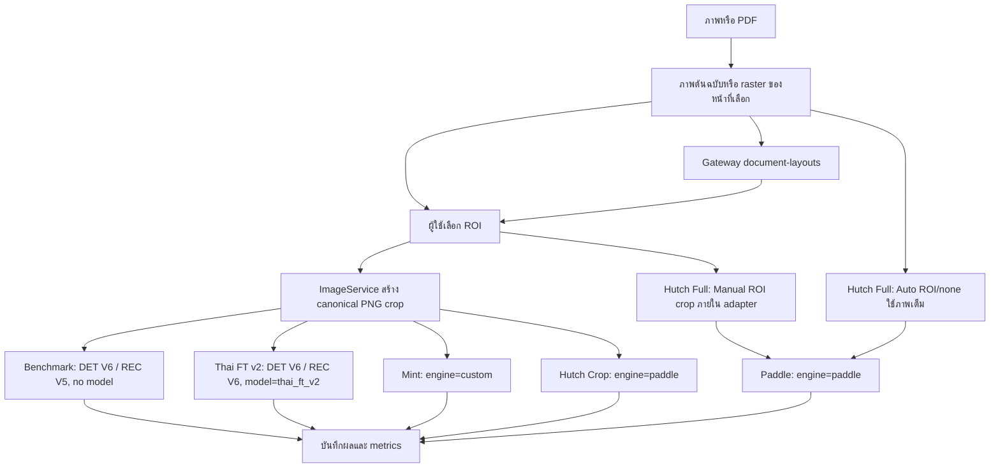

# ขั้นตอนใช้งานและเส้นทางข้อมูล

1. อัปโหลด PNG/JPG/รูปแบบภาพที่รองรับหรือ PDF เลือกหน้า PDF ก่อนสร้างชุดทดสอบ
2. ซูม เลื่อนภาพ และวาด/ย้าย/ปรับขนาด ROI พิกัดเก็บเทียบภาพต้นฉบับ ไม่ใช่พิกัดหน้าจอ
3. อาจใช้ Auto Detect แล้วเลือกหนึ่งกรอบเพื่อปรับต่อเอง หากบริการไม่พร้อมยังวาด ROI ได้
4. เลือก Pipeline แล้วรัน ผลแต่ละรายการบันทึกอัตโนมัติ แม้อีกรายการล้มเหลว Ground Truth เริ่มที่โหมดราย Field จากกรอบ OCR: กรอก → ตรวจ (preview) → ยืนยัน หรือเลือกโหมดทั้งเอกสาร/ROI เดิม
5. ดูข้อความ กรอบ ความมั่นใจ CER/WER/Exact Match และเวลา ยืนยัน Ground Truth ได้โดยไม่เขียนทับ prediction
6. เปิด History → Test Detail เพื่อตรวจผลซ้ำ แล้วใช้ Matrix/Category Analytics เปรียบเทียบผลล่าสุดต่อ case/pipeline

Mint ภายนอกใช้ DET V5 แล้วตัด text regions ก่อน Thai REC; Hutch Crop ใช้ DET V6 + Thai REC ผ่าน Paddle ค่า detection ส่งชัดเจน 1.7 / 0.25 / 0.6

Hutch Full ดู `roi_source`: `auto` และ `none` ส่งภาพเต็ม/หน้า PDF เต็ม; `manual` crop ภายใน adapter ก่อนส่ง Paddle ไม่ส่งพิกัด ROI ให้ Gateway การขยับ/resize Auto ROI ยังคง source=auto; การวาดใหม่เปลี่ยนเป็น manual โดยไม่ลบ suggestions

## การอ่านข้อมูล debug

`SAME INPUT`/`DIFFERENT INPUT` เปรียบเทียบ crop SHA ของผลที่ใช้ crop รวม Benchmark, Thai FT v2 และ Hutch Full แบบ manual (`crop_stage=manual_roi`) เมื่อใช้ Auto ROI/none Hutch Full เก็บ `input_sha256`/ขนาดภาพเต็ม โดย `crop_sha256` เป็น null และ `crop_stage=full_image`

เมื่อ Hutch Full ใช้ภาพเต็มต่างจาก crop ต้องพิจารณาขอบเขตข้อความและ GT ก่อนเทียบความแม่นยำ ข้อมูลเก่าที่ไม่ระบุ source ไม่ถูกเดาว่า manual และคงพฤติกรรมภาพเต็ม อ่านรายละเอียด [Field GT/ROI/Dataset](fields-roi-dataset.md)
