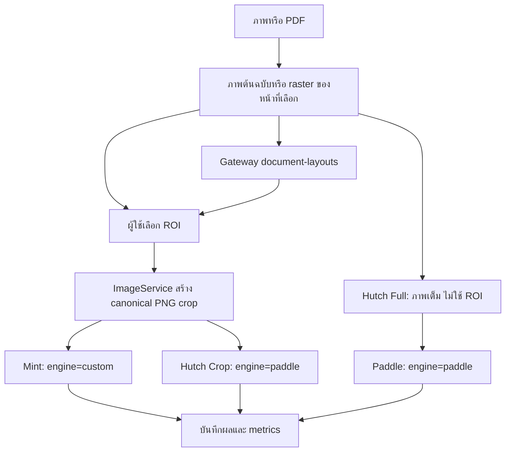

# ขั้นตอนใช้งานและเส้นทางข้อมูล

1. อัปโหลด PNG/JPG/รูปแบบภาพที่รองรับหรือ PDF เลือกหน้า PDF ก่อนสร้างชุดทดสอบ
2. ซูม เลื่อนภาพ และวาด/ย้าย/ปรับขนาด ROI พิกัดเก็บเทียบภาพต้นฉบับ ไม่ใช่พิกัดหน้าจอ
3. อาจใช้ Auto Detect แล้วเลือกหนึ่งกรอบเพื่อปรับต่อเอง หากบริการไม่พร้อมยังวาด ROI ได้
4. กรอก Ground Truth และประเภทข้อมูล เลือก Pipeline แล้วรัน ผลแต่ละรายการบันทึกอัตโนมัติ แม้อีกรายการล้มเหลว
5. ดูข้อความ กรอบ ความมั่นใจ CER/WER/Exact Match และเวลา ยืนยัน Ground Truth ได้โดยไม่เขียนทับ prediction
6. เปิด History → Test Detail เพื่อตรวจผลซ้ำ แล้วใช้ Matrix/Category Analytics เปรียบเทียบผลล่าสุดต่อ case/pipeline

Mint ภายนอกใช้ DET V5 แล้วตัด text regions ก่อน Thai REC; Hutch Crop ใช้ DET V6 + Thai REC ผ่าน Paddle ค่า detection ส่งชัดเจน 1.7 / 0.25 / 0.6

Hutch Full ส่งภาพเต็มหรือหน้า PDF ที่เลือกเป็น PNG ไปยัง Paddle โดยไม่ใช้ ROI และไม่ crop ในแอป ตามคำยืนยันล่าสุดจากเจ้าของ Pipeline ไม่มีขั้นตอนรอ ROI contract

## การอ่านข้อมูล debug

`SAME INPUT`/`DIFFERENT INPUT` เปรียบเทียบ crop SHA ของ Mint กับ Hutch Crop เท่านั้น ทั้งคู่ต้องรับ PNG bytes เดียวกัน Hutch Full เก็บ `input_sha256`/ขนาดภาพเต็ม โดย `crop_sha256` เป็น null และ `crop_stage=full_image` ค่านี้หมายถึงไม่มีการ crop และไม่ใช้ ROI

Hutch Full ใช้ภาพเต็มต่างจาก crop จึงต้องพิจารณาขอบเขตข้อความและ Ground Truth ก่อนเทียบความแม่นยำ ห้ามสรุปว่าความต่างเกิดจาก inference อย่างเดียว
